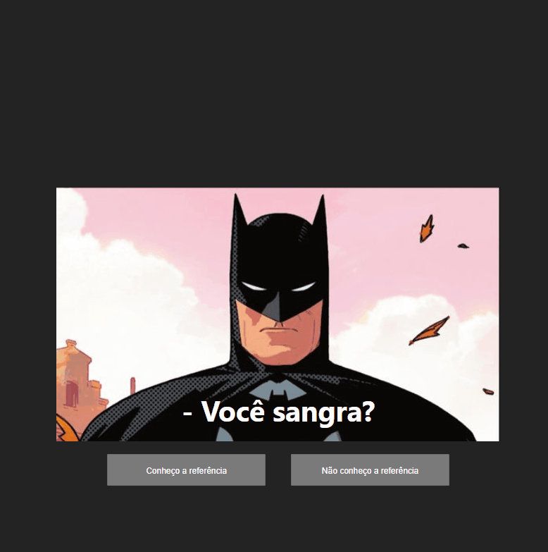

# Projeto React 

## O projeto é simples, usa codigo JSX 

 

[]

### Informações do projeto  
Foi usado componentes e props para renderizar um novo texto, adicionando uma nova cor ao texto e transformando em (uppercase).

Ah também um componente Button com evento de clique onde aprensenta na tela uma alerta informando a porp label do botão com uma mensagem para cada botão 

### Tecnologias usadas no projeto
- HTML ✔
- CSS 🎨
- JavaScript / React/ JSX 🧠

### Como utilizar
Você pode clicar na imagem com o mouse e também nos botões abaixo da imagem 